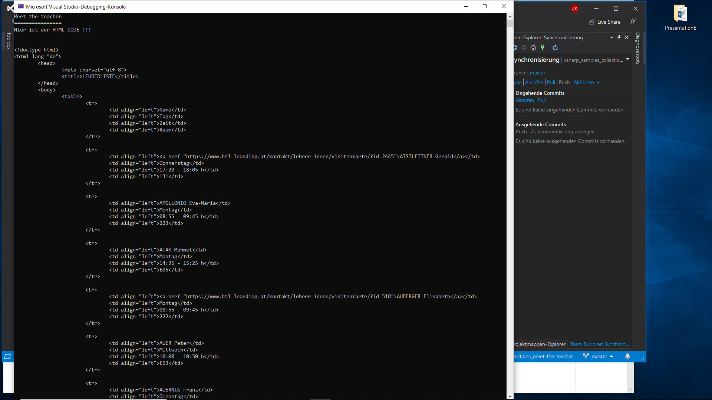

### Meet the Teacher

*	Wiederholung Objektorientierung              :ballot_box_with_check:
*	Abgeleitete Klassen                          :ballot_box_with_check:
*	Überschriebene Methoden                      :ballot_box_with_check:
*	Collections: `List<T>`, `Dictionary<K,V>`    :ballot_box_with_check:
*	`IComparable<T>`                             :ballot_box_with_check:

Es ist eine Konsolenanwendung zu realisieren, die aus drei Textdateien im CSV-Format (Codierung: UTF-8) die HTML-Sprechstundentabelle für die Homepage der HTL-Leonding erzeugt:

Meine Ausgabe:

