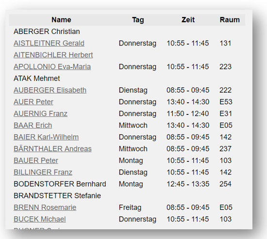
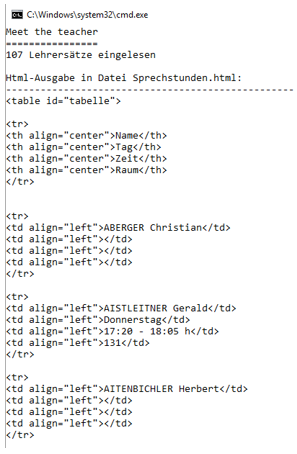

# Meet the Teacher


## Lehrziele

*	Wiederholung Objektorientierung
*	Abgeleitete Klassen
*	Überschriebene Methoden
*	Collections: `List<T>`, `Dictionary<K,V>`
*	`IComparable<T>`

Es ist eine Konsolenanwendung zu realisieren, die aus drei Textdateien im CSV-Format (Codierung: UTF-8) die HTML-Sprechstundentabelle für die Homepage der HTL-Leonding erzeugt:


 


Folgende Zusammenhänge sind zu berücksichtigen:

* Die Sprechstundendaten aller Lehrer werden über ihre Stammdaten beschrieben. Diese sind aus der Datei `Teachers.csv` (siehe dazu das Projekt `MeetTheTeacher.UI` im Ordner `Input`) auszulesen und in einer generischen Liste vom Typ `Teacher` zu speichern. Die Lehrer sind in dieser Datei nicht zwingend alphabetisch geordnet. Für einen Standardeintrag wird ein Objekt der Klasse `Teacher` erstellt und in einer Liste abgelegt.

* Für einen Teil der Lehrer gibt es zusätzliche Informationen, welche sich auf einer Detailseite (identifiziert über eine Seiten-ID) befinden. Für derartige Einträge definieren Sie die Klasse `TeacherWithDetails`, die vom Standardeintrag (`Teacher`) abgeleitet ist und zusätzlich ein Feld `_id` beinhaltet. Diese `TeacherWithDetails`-Objekte sind natürlich ebenfalls in der selben generischen Liste abzulegen (sind ja auch Teacher).
  * Die Daten für die zusätzlichen Einträge stehen in der CSV -Datei `Details.csv`, die sich im Projekt `MeetTheTeacher.UI` im Ordner `Input` befindet. Es gibt die zwei Spalten `Name` und `ID` für jene Lehrer, die eine Detailseite haben. 
  * Hinweise
    * Übernehmen Sie zuerst die Daten der `Details.csv` in ein `Dictionary`, um einfach über den Namen auf die `Id` zugreifen zu können. Erst danach `Techers.csv` einlesen: Falls der jeweilige `Name` bereits im `Dictionary` enthalten ist => Objekt der Klasse `TeacherWithDetails` erstellen, sonst normalen `Teacher` erstellen.
    * Die Groß-/Kleinschreibung soll beim Vergleich der Namen nicht berücksichtigt werden!

* Die dritte Datei `IgnoredTeachers.csv` enthält jene Lehrer, die nicht auf der Sprechstundentabelle ausgegeben werden sollen (karenzierte Lehrer, Lehrer die an andere Schulen verliehen sind, ...). Diese Lehrer können aus der internen Datenstruktur gelöscht werden. Auch hier ist die Groß-/Kleinschreibung nicht zu beachten.

* Nachdem alle Einträge eingelesen und in der generischen Liste abgelegt wurden, kann der HTML-Code entsprechend der Listeneinträge (Musteroutput beachten => `MusterOutput.html`) erstellt werden.
  * Vorher ist die Liste nach dem Namen des Lehrers aufsteigend zu sortieren
    * Teacher muss IComparable<Teacher> implementieren.
    * Liste kann einfach über _teachers.Sort() sortiert werden.
    * Verlässt sich auf IComparable der Listenelemente.

  * Nutzen Sie Vererbung und Deltaprogrammierung um vom Teacher die entsprechende HTML-Ausgabe zu erhalten.
  * In der Html-Ausgabe sind die Sonderzeichen in den Namen der Lehrer im HTML-Format zu codieren. Dazu gibt es die Hilfsmethode `HtmlEncode(string)` in der Klasse `WebUtility`

* Eine Klasse Controller.cs steuert den gesamten Ablauf und verwaltet in Collections die erforderlichen Listen.


# Klassendiagramm
 


# Konsolenprogramm

Das Hauptprogramm `MeetTheTeacher.UI` (.NET Core Konsolenanwendung) liest die csv-Dateien ein (UTF-8) und verwendet den Controller zum Filtern/Aufbereiten der Daten und dem Erzeugen des HTML-Textes. Es speichert den HTML-Text in die Ausgabedatei `.\Output\Sprechstunden.html`. Verwenden Sie dazu die Methode `File.WriteAllText()`.

# Hinweise

1. Überschreiben Sie die Methode string GetNameHtmlLine () der Klasse Teacher in der abgeleiteten Klasse TeacherWithDetail. 
1. Bei normalen Einträgen (Klasse `Teacher`) soll die Methode lediglich den Namen als HTML Tabellenelement zurückliefern: 

    ``` html
    <td align="left">Kerschner Martin</td>
    ```


1. Bei speziellen Einträgen (Klasse `TeacherWithDetail`) soll der Name des Lehrers und ein Link auf die ID in den HTML String eingebaut werden: 

    ``` html
    <td align="left"><a href="?id=436">K&ouml;ck Gerald</a></td>
    ```
    
     (wobei an Stelle von 436 natürlich die ID des jeweiligen Lehrers stehen soll).

1. Achten Sie beim Einlesen bzw. Erstellen der Dateien auf eine korrekte `UTF-8 Codierung`. Somit werden auch etwaige Umlaute und Sonderzeichen in den Eingabe-/Ausgabe-Dateien korrekt dargestellt.

1. Achtung: Unit-Tests dürfen nicht verändert werden! Beachten Sie bei der Wahl der Bezeichner (Methoden-, Variablennamen, etc.) das Klassendiagramm bzw. auch die Verwendung in den Unit-Tests.


# Ausgabe
Ein Muster für die Ausgabe finden Sie in der Datei `MusterOutput.html`.

Exemplarische Ausgabe:



